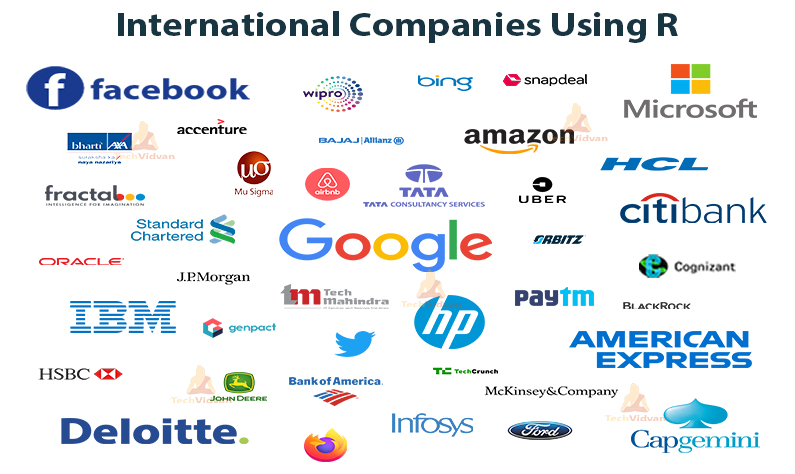

There are many R tutorials out there.  This one aims to be a jump start to get you to know exactly what you need to start using R while ignoring all the stuff that you can quickly search for. 

As for many topics, tools, and trades, getting the feel of things and figuring out the way they work is the first step. Everything else is the details, so to speak.  Here's the idea: Working through this guide will give you the tools to start digging into a project and have an idea of what you are doing.  More importantly, you'll know in a general way how things function in an R way, so when you have questions (no one has all the answers, no one) you'll be able to quickly find solutions and be on your way to R greatness.

This guide is broken up into 10 bite-sized parts.  Each one of these parts could probably have a book written about them.  Some of these parts _have_ had books written about them.  Don't let that be overwhelming.  Think of it this way: there have been many, many, many books written about very specific Excel things and unless you really need to become an expert in those very specific Excel things, you, like the rest of the world, will simply look up what you need to know when you need to know it.  What you do need to know is how things work in general and what to search for when you need answers.  That's the aim here, quick and dirty. 

* Introduction
* An example
* Basic functions and the R Studio environment - some tips
* Getting data in
* Working with data - oh, boy
* Doing stuff with data
* Coffee break 
* Presenting your results - tables
* Presenting your results - graphs and figures
* Github - yeah, you probably want to get on this boat.


## Introduction 

So why R?

This is usually where we start, and for a good reason. Why spend time learning something new, ehh?  

Here's the low-down: R is a tool. Powerpoint is a tool. While Powerpoint is a one-trick-pony, R can do tons of things, and for many of those things, it does them very well while being fast and efficient in the process.




(image from https://techvidvan.com)


## An example

Get data, do stuff with the data, communicate the results.

### Get some data

```{r , warning=FALSE, message=FALSE}

library(tidyverse)

us_crime <- USArrests %>%
  rownames_to_column( var = "State") 

str(us_crime)

summary(us_crime)

head(us_crime)

```

### Do stuff with the data

```{r , warning=FALSE, message=FALSE}

us_crime %>%
  ggplot(aes(x = State, y = Assault)) +
  geom_col() +
  coord_flip()

```

### Communicate the results

## The basics

Installation of R and R studio:


Here in 2021, there are a few things that are so integrated in R that we should skip the small talk and just have you start off what you will be using:

* You want to use Rstudio
* You want to use Tidyverse

What's that?  Rstudio is an IDE - it makes using R and everything R related easy.  Tidyverse is a way of doing things that makes things easy.  That's all the information you need.
