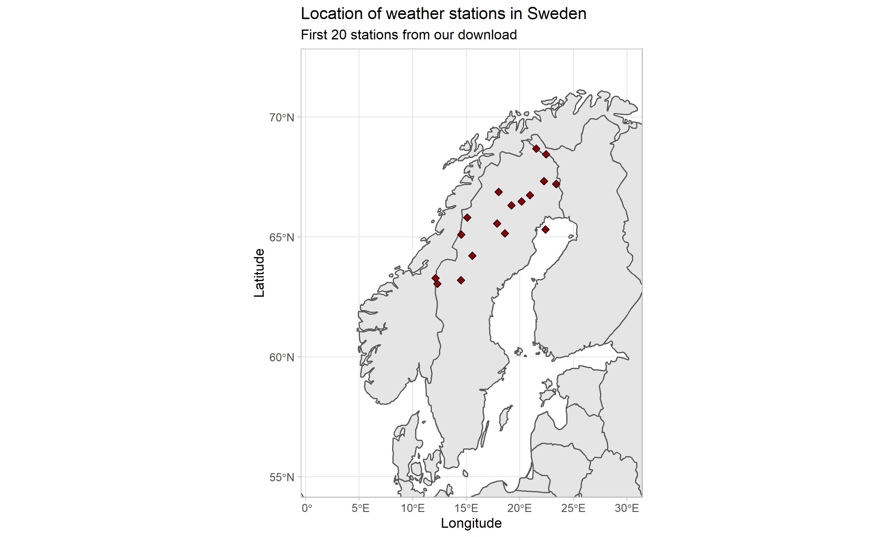

Last week I read a great paper: "Weathering cash flow shocks" by Brown et al. (2021) which cleverly used unexpected severe winter weather as a setting to examine shocks to firm cash flow and the effect these cash flow socks have on utilizing and increasing credit lines.

The authors scrape decades worth of publicly available weather data from weather stations across the United States to identify abnormal snow cover in counties where firm headquarters are located.
They use this data to identify exogenous shocks to cash flow and subsequently test behavior related to these drops in internal finance.  Neat!

My first thought when reading this was: "I wonder if there is an R package for this?"

My search began and what do you know, there is!
Two in fact!

I first took a look at the __rnoaa__ package available on CRAN,
and after spending some time with it I concluded it was a little tricky to navigate and the documentation left more to be desired.

I then stumbled upon the lovely __FluMoDL__ package,
which has a focus on implementing methods to estimate influenza-attributable mortality.
That sounds like absolutely nothing to do with weather station data.

However,
a primary input in these models is a daily mean temperature for the region of interest and the authors bundled up some functions that efficiently access and return weather station data from NOAA.

Here's how it works.
the function __NOAA_getGSOD__ will download daily weather summaries for a set of weather stations for a given set of years.
So first we will need to get a list of interesting stations.
__FluMoDL__ has two functions to do this,
__NOAA_allStations__ which returns a list of available stations,
and __NOAA_countryStations__ which downloads a list of stations located in a particular country.
We'll be be using the latter to grab some Swedish weather data.


```{r, eval=FALSE, results='hide', error=FALSE, warning=FALSE, message=FALSE}

install.packages("FluMoDL")

library(FluMoDL)
library(tidyverse)
library(lubridate)

```


```{r, eval=FALSE, results='hide', error=FALSE, warning=FALSE, message=FALSE}

station_list_sw <- NOAA_countryStations('SW',
                                        from = 2020,
                                        to = 2021) #returns Swedish stations from 2020-2021

str(station_list_sw) 

```


```{}
> str(station_list_sw)
'data.frame':	157 obs. of  11 variables:
 $ usaf        : chr  "020480" "020500" "020520" "020530" ...
 $ wban        : int  99999 99999 99999 99999 99999 99999 99999 99999 99999 99999 ...
 $ station.name: chr  "MALMBERGET" "RIKSGRANSEN" "KVIKKJOKK         &" "MALMBERGET" ...
 $ ctry        : chr  "SW" "SW" "SW" "SW" ...
 $ state       : chr  "" "" "" "" ...
 $ icao        : chr  "" "" "" "" ...
 $ lat         : num  67.2 68.4 67 67.1 68 ...
 $ lon         : num  20.7 18.1 17.8 20.7 21.8 ...
 $ elev.m.     : num  375 508 337 365 360 402 17 7 318 403 ...
 $ begin       : Date, format: "1935-01-01" "1935-01-01" ...
 $ end         : Date, format: "1991-05-05" "1977-06-30" ...
```

Notice is that __NOAA_countryStations__ returns the latitude and longitude of the stations,
data which we could use to make some nice maps.
Also,
it appears the variable __end__ contains dates outside of our range,
this could be an error of some sort,
but we'll fix this below.

We'll limit our scope and pull data for the first 20 weather stations,
using __head(20)__ to return the first 20 observations of __station_list_sw__.
As we are pulling daily weather data,
we'll limit the amount of data for this exercise,
but it should give you an idea of what is possible.

First,
we filter out observations with years below 2020 leveraging the __year__ function in __lubridate__.
Then we will pass the object to __NOAA_getGSOD__,
along with a year range and a few options to download some data:
__match.columns = "station.name"__ to include a vector of stations names in the output,
and __progress = TRUE__ to include a progress bar on the download.

```{r, eval=FALSE, results='hide', error=FALSE, warning=FALSE, message=FALSE}


stations_sw <- station_list_sw %>%
  filter(year(end) >= 2021) %>% 
  head(20)


df_station <- NOAA_getGSOD(stations_sw,
                    years = 2021,
                    match.columns = "station.name",
                    progress = TRUE)


head(df_station)


```

```{}
> head(df_station)
    usaf  wban       date temp tempC dewp dewpC    slp slpC   stp stpC visib visibC wdsp
1 020550 99999 2021-01-01 -5.5    24 -6.9    24     NA    0    NA    0  19.6     24  3.7
2 020640 99999 2021-01-01 -4.6    24 -7.0    24     NA    0    NA    0  16.5     24  3.7
3 020810 99999 2021-01-01 -5.6    24 -6.8    24 1015.7   24 974.2   24  18.7     23  4.9
4 020550 99999 2021-01-02 -8.2    24 -9.6    24     NA    0    NA    0  27.0     24  3.0
5 020640 99999 2021-01-02 -6.3    24 -9.5    24     NA    0    NA    0  23.0     24  2.3
6 020810 99999 2021-01-02 -7.3    24 -8.6    24 1018.2   24 976.5   24  26.4     24  2.6
  wdspC mxspd gust maxtemp maxtempF mintemp mintempF prcp prcpF sndp frshtt station.name
1    23   7.8   NA    -3.3             -8.5          0.05     G   NA   1000     NAIMAKKA
2    24   5.8 11.5    -2.8        *    -7.4        * 0.12     G   NA   1000   SAITTAROVA
3    24   7.8   NA    -3.1             -8.0          0.03     G   NA   1000   KARESUANDO
4    18   3.9   NA    -7.0            -14.4        * 0.00     G   NA   1000     NAIMAKKA
5    24   4.1   NA    -5.8        *    -7.4          0.03     G   NA   1000   SAITTAROVA
6    22   5.8   NA    -6.4            -13.9        * 0.00     G   NA   1000   KARESUANDO
```

We can now merge the weather data with the station data and some some quick tidying to get a nice final data set to work with.
We will take advantage of the pipe and dplyr's excellent data cleaning functions,
coupled with __group_by__ and __summarise__ to get a monthly average temperature by station. 


```{r, eval=FALSE, results='hide', error=FALSE, warning=FALSE, message=FALSE}

df_weather_sw <- df_station %>% 
  left_join(station_list_sw,
            by = "station.name") %>% 
  select(date, station.name, temp, lat, lon) %>% 
  mutate(month = month(date, label = TRUE)) %>% 
  group_by(station.name, month) %>% 
  summarise(mean_temp = mean(temp),
            lat = lat,
            lon = lon)


```


```{r, eval=FALSE, results='hide', error=FALSE, warning=FALSE, message=FALSE}

theme_set(theme_light())

rand_station <- df_weather_sw %>% # Select 5 random staions from df
  group_by(station.name) %>% 
  summarise() %>% 
  sample_n(5) 

df_weather_sw %>%
  filter(station.name %in% rand_station$station.name) %>% 
  ggplot(aes(x = factor(month), y = mean_temp, fill = station.name)) +
  geom_bar(position="dodge", stat="identity") + 
  scale_fill_brewer(palette = "Set1") +
  labs(title = "Average temp of Swedish weather stations in 2021",
       subtitle = "Five random stations",
       x = "Month",
       y = "Avg Temp in C",
       fill = "Station name") + 
  theme(legend.position="bottom")


```

```{r, eval=FALSE, include=FALSE}

library(here)

ggsave(here("content/post/2022-03-07-weather-data-with-r", "staion_temp.jpg"),
        width = 10,
        height = 6)

```


I'm going to go out on a limb here and guess that NOAA doesn't have the most comprehensive coverage outside of the US as only four out of ten stations ended up having workable data.

While we're at it,
we can load the __sf__ and __rnaturalearth__ packages to quickly plot the location of the weather stations we downloaded on a map. 

```{r, eval=FALSE, results='hide', error=FALSE, warning=FALSE, message=FALSE}

library(sf)
library(rnaturalearth)


world <- ne_countries(scale = "medium", returnclass = "sf")

ggplot(data = world) +
  geom_sf() +
  geom_point(data = df_weather_sw, aes(x = lon, y = lat), size = 2, 
             shape = 23, fill = "darkred")+
  coord_sf(xlim = c(1,30), ylim = c(55,72), expand = TRUE) +
  labs(title = "Location of weather stations in Sweden",
       subtitle = "First 20 stations from our download",
       x = "Longitude",
       y = "Latitude")

```

```{r, eval=FALSE, include=FALSE}

library(here)

ggsave(here("content/post/2022-03-07-weather-data-with-r", "staion_map.jpg"),
        width = 10,
        height = 6)

```



We could do some more fancy plotting with geographical data, 
but we will save that for another post.

Happy plotting!

For more information on __FluMoDL__ check it out here:

https://www.rdocumentation.org/packages/FluMoDL/versions/0.0.3
